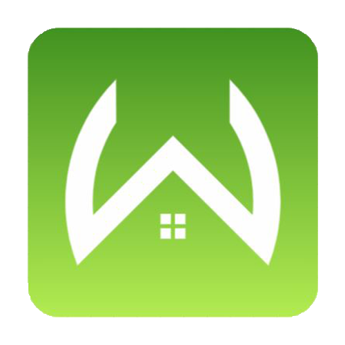

<p align="center">
  <a href="https://github.com/Dedition/WhoDis">
    
  </a>

  <h3 align="center">WhoDis?</h3>

  <p align="center">
   WhoDis?, a Discord clone, is a messaging app that allows users to make servers, channels inside servers and message their friends through channels.
    <br />
    <a href="https://github.com/Dedition/WhoDis"><strong>Explore the docs »</strong></a>
    <br />
    <br />
    <a href="https://github.com/Dedition/WhoDis">View Site</a>
    ·
    <a href="https://github.com/Dedition/WhoDis/issues">Report Bug</a>
    ·
    <a href="https://github.com/Dedition/WhoDis/issues">Request Feature</a>
  </p>
</p>


<details open="open">
  <summary><h2 style="display: inline-block">Table of Contents</h2></summary>
  <ol>
    <li>
      <a href="#about-the-project">About The Project</a>
      <ul>
        <li><a href="technologies">Technologies</a></li>
      </ul>
    </li>
    <li><a href="#getting-started">Getting Started</a></li>
    <li><a href="#roadmap">Roadmap</a></li>
    <li><a href="#contributing">Contributing</a></li>
    <li><a href="#contact">Contact</a></li>
    <li><a href="#future-goals">Future Goals</a></li>
  </ol>
</details>


## About The Project


[Click here to view WhoDis? live!](https://whodis-app.herokuapp.com/)
<br>
Screenshot (132).png
</br>


## Overall Structure

### Back End

The app was built using Flask/Python and SQLAlchemy on the back end with a PostgreSQL database.
Model associations are used to minimize database queries to the backend, assuring speed and reliability.

### Front End

The front end is built with React and Javascript while utilizing Redux architecture, producing a lightning-fast user interface and calling upon dynamically rendered components.


### Technologies

- [Python](https://www.python.org/)
- [React](https://reactjs.org/)
- [Redux](https://redux.js.org/)
- [Flask](https://flask.palletsprojects.com/en/2.1.x/)
- [HTML](https://html.com/)
- [CSS](http://www.css3.info/)


## Getting started
1. Clone this repository (only this branch)

   ```bash
   git clone https://github.com/Dedition/WhoDis.git
   ```

2. Install dependencies

      ```bash
      pipenv install --dev -r dev-requirements.txt && pipenv install -r requirements.txt
      ```

3. Create a **.env** file based on the example with proper settings for your
   development environment
4. Setup your PostgreSQL user, password and database and make sure it matches your **.env** file

5. Get into your pipenv, migrate your database, seed your database, and run your flask app

   ```bash
   pipenv shell
   ```

   ```bash
   flask db upgrade
   ```

   ```bash
   flask seed all
   ```

   ```bash
   flask run
   ```

6. To run the React App in development, checkout the [README](./react-app/README.md) inside the `react-app` directory.


## Roadmap
See the [open issues](https://github.com/Dedition/WhoDis/issues) for a list of proposed features (and known issues).


## Contributing

Contributions are what make the open source community such an amazing place to be learn, inspire, and create. Any contributions you make are **greatly appreciated**.
1. Fork the Project
2. Create your Feature Branch
3. Commit your Changes 
4. Push to the Branch 
5. Open a Pull Request


## Contact & Acknowledgements

- Leo Lad - [GitHub](https://github.com/Dedition)
- Weiqi Mei - [GitHub](https://github.com/weiqimei)
- Sona Jasani - [GitHub](https://github.com/sonajasani)
- Anthony Rodriguez - [GitHub](https://github.com/AnthonyRo1)
- Project Link: [https://github.com/Dedition/WhoDis](https://github.com/Dedition/WhoDis)


## Future Goals
- Search Bar
- Direct Messaging
- Friend Requests